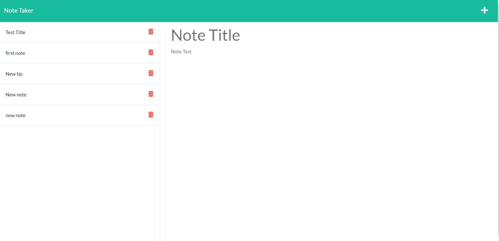

# Express-Note_Taker

This project is a generated note taker where a user can input a new note and that note will be saved to the website.

User guide:
The user will run npm start after they have navigated to the proper integrated terminal in VSCode, once that is done 
the user will then run the command npm start. What should happen is the user is givin a link to fallow that will take them to the Note Taker home page. The user will simply press on the "Get Started" button and will be taken to the actual page that the user will be able to input a new note.
1st step enter a title for your new note
2nd step enter the note you wish to save under the title 
3rd step navigate to the top right corner of the page and find the save button "this button will have an icon not letters" 
In those three steps the user would have created a new note and had it saved to the note taker page.

screen shots of the home page and the note taker page.

Credit:
https://chat.openai.com/?model=text-davinci-002-render-sha
https://developer.mozilla.org/en-US/docs/Web/API/Fetch_API/Using_Fetch
